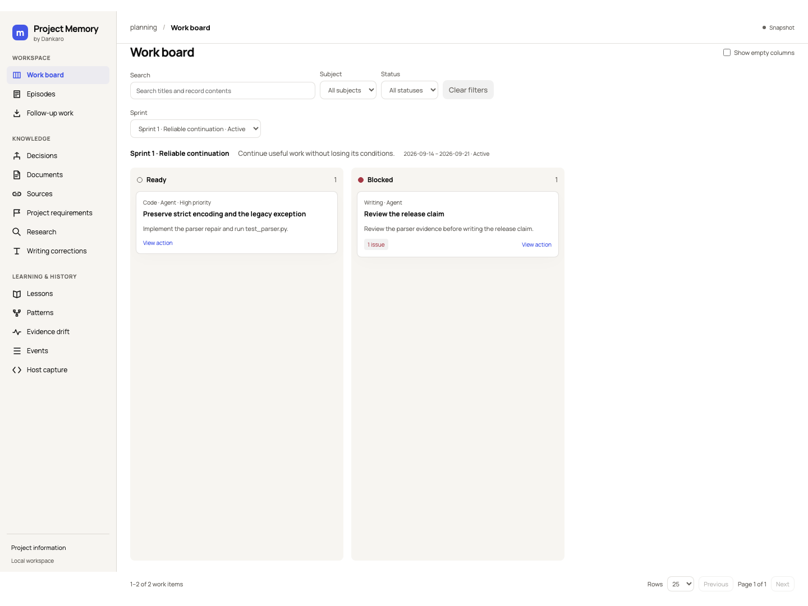

# Project Memory

Project Memory keeps a project's decisions, evidence, outcomes and reviewed lessons in a local SQLite database. An AI assistant retrieves the relevant records through three MCP tools; people inspect the same history in a self-contained HTML viewer.

The [work board](docs/work-board.md) groups actions into sprints and connects each card to its intended result, scope, next action and decision history. The assistant uses the same checked state to resume work, inspect uncertain execution and recognise when human input is needed. Start with the [user guide](docs/user-guide.md) for opening the workspace, following work and resolving missing updates. The current development version adds interactive planning and conditional agent checks; see [workspace and agents](docs/workspace-agents.md).

Use it when a project repeatedly revisits research, loses the reasons behind decisions, or carries outdated requirements into new work. It preserves the original evidence and the conditions under which a decision or lesson applies.

**Public beta.** The runtime uses Python 3.11+ and its standard library. There is no model service, vector database, telemetry or background maintenance process. The assistant still interprets evidence and needs explicit agreement before accepting a lesson or changing project requirements. [Evidence and limits](docs/evidence.md) describe what has actually been measured.

<!-- mcp-name: io.github.Dankaro-projects/project-memory -->

## Install and connect

Install [uv](https://docs.astral.sh/uv/getting-started/installation/), then run this **inside the project you want to remember**:

```sh
uvx project-memory-mcp@0.5.0b4 setup --client codex --trust
```

This creates `.memory/project.sqlite`, adds a project-local MCP connection and nine command hooks, and asks the installed Codex host for the exact hook hashes to enable. Existing settings and records are preserved. Setup opens the included live HTML viewer; add `--no-view` for headless use. Open a new Codex task afterwards. `--trust` explicitly enables these project hooks; omit it to review and enable them in Codex yourself.

For Claude Code, run the same command with `--client claude`:

```sh
uvx project-memory-mcp@0.5.0b4 setup --client claude --trust
```

This adds the `project_memory` server to the project's `.mcp.json` and the lifecycle hooks to `.claude/settings.local.json`, which Claude Code keeps out of version control. `--trust` pre-approves the project MCP server in that local settings file; omit it to approve the server when Claude Code asks. Start a new Claude Code session in the project afterwards. Claude Code has no interrupt hook, so eight of the nine lifecycle events are captured there; an interrupted tool call remains visible as an unconfirmed receipt. Claude Code's tool failure event closes the same receipt as a completed call, with the failure retained. After automatic compaction, the session start hook restores the memory session, the active decision and the reconciliation count.

For a permanent CLI installation:

```sh
uv tool install project-memory-mcp==0.5.0b4
project-memory doctor
project-memory view
```

For another local MCP client, run `project-memory setup --client mcp`, then configure the client to run `project-memory serve --project /absolute/path/to/project`. Generic MCP supports explicit records and retrieval; automatic receipts exist for Codex and Claude Code. The Codex integration has been verified in a live host; the Claude Code integration has a bounded live CLI check, with separate limits on interruption and compaction evidence. [Setup and lifecycle](docs/setup.md) includes imports, upgrades, backup, uninstall and client configuration.

Claude Code can also install the plugin, which provides the three tools, the lifecycle hooks and a workflow skill in every project that has run `project-memory setup --client mcp`:

```sh
claude plugin marketplace add Dankaro-projects/project-memory
claude plugin install project-memory@dankaro
```

Claude plugin hooks skip capture when managed project hooks are present. Keep one MCP connection enabled to avoid presenting the same tools twice. Codex does not discover the Claude hook file.

The same versioned wheel is available from [GitHub Releases](https://github.com/Dankaro-projects/project-memory/releases). The MCPB asset supports directory selection in compatible desktop clients.

Published on [PyPI](https://pypi.org/project/project-memory-mcp/0.5.0b4/), the [official MCP Registry](https://registry.modelcontextprotocol.io/v0.1/servers/io.github.Dankaro-projects%2Fproject-memory/versions/0.5.0b4), and [Smithery](https://smithery.ai/servers/msuteu/project-memory). The [Glama listing](https://glama.ai/mcp/servers/Dankaro-projects/project-memory) is also claimed and has a tested beta container release. See [distribution and compatibility](docs/distribution.md) for verified launch paths and remaining limits.



## Use it in ordinary work

Ask your assistant:

> Capture VISION.md and our decision log. Show which statements are evidence, proposals and agreed requirements. Preserve the originals. Before choosing an approach, retrieve relevant decisions and check whether their evidence is still current.

Then work normally. The assistant supplies record IDs and versions. You review the meaning, rather than maintain a second set of forms.

- A decision records its evidence, initial choice, alternatives, uncertainty, expected consequences and conditions for reconsideration.
- Actions and actual outcomes attach to that decision. Revisions retain the earlier choice and its result.
- Successful practices, anti-patterns and recoveries can become proposed lessons. A separate review accepts, rejects or retires them, with their scope and exceptions intact.
- Code reviews, writing corrections and research remain separate subjects. A dependency across subjects must name the evidence and explain why it matters.
- Selected Markdown files are captured verbatim. Changed, missing and superseded evidence is flagged. Importing a vision does not approve its proposals.
- Approved project requirements can evolve through append-only revisions. Earlier decisions retain the version they used and become reviewable when the agreed basis changes.

Run `project-memory view` for decisions, documents, corrections, patterns, drift, captures and unresolved work. It opens a live local workspace with paged records, evidence navigation and automatic refresh. The development version also lets you create actions and sprints, revise plans, add comments and inspect or cancel agent checks. The [workspace interface](docs/workspace-ui.md) adds sidebar navigation, a side inspector and formatted documents with access to the original text. Source text loads on demand. Use `--output review.html --include-bodies` for an offline snapshot.

## What is automatic

Codex and Claude Code hooks mechanically record session and tool events, sizes, hashes and available execution metadata. They do not turn a failed command into a lesson or assume that an interrupted command rolled back. The assistant records interpretation separately and checks side effects before retrying uncertain work.

Retrieval returns bounded, complete records and preserves exceptions. Search indexes and explicit source slices support expansion when needed. The default MCP reply limit is 6,000 characters, with an explicit maximum of 20,000; these are **characters in the tool result, not complete model-input tokens**. Keeping every model input below 10K tokens remains a target, subordinate to quality and feature preservation.

## Develop and verify

```sh
python -m unittest discover -s tests -q
python -m examples.document_case --output results/documents
python -m examples.host_example --output results/host-example
node tests/viewer_logic.cjs
uv build
python scripts/check_artifacts.py dist
python scripts/installed_smoke.py dist
```

The public artifacts contain code, documentation and synthetic examples. They exclude project databases, host transcripts, private evaluation archives and local configuration. [Contributing](CONTRIBUTING.md), [security](SECURITY.md), [record fields](docs/record-fields.md), [release process](docs/releasing.md).

The [first-beta feedback review](docs/feedback-2026-09-14.md) records the observed workflow defects, the fixes, comparable measurements and remaining limits.

The [autonomy and Kanban report](docs/autonomy-2026-09-14.md) records actual continuation, interruption recovery and board checks, including the unmet full-input target.

The unreleased completeness changes and their measured limits are documented in the [completeness evaluation](docs/completeness-evidence-2026-09-14.md).
